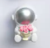

# Rosette(玫瑰之心): 机器人框架(WIP: Work In Progress)
rust实现.

|小王子怎么也想不到, |机器人也有理想, 通往诗和宇宙深深处。|
|-------------------------------------------------------|----------------------------------------|
|||

## 使用说明
### 特性
1. 分布式通信(类似ROS2)

### 对比
||Rosette|ROS2|
|--|-----|----|
|分布式通信|✅|✅|
|开发语言|Rust|C++|

### 支持列表
#### 一级支持(Tier1)
* [x] Linux(ubuntu)

#### 二级支持(Tier2)
* [ ] macOS
* [ ] windows
* [ ] harmonyOS

### 功能规划
#### rosette_cli
* [ ] action动作指令
* [ ] bag数据包处理
* [ ] component组件
* [ ] daemon守护进程
* [ ] doctor自检
* [ ] interface接口
* [ ] launch启动
* [ ] lifecycle生命周期
* [ ] multicast多播
* [ ] node节点
* [ ] param参数
* [ ] pkg包管理
* [ ] playground可视化调试命令
* [ ] run运行
* [ ] security安全性
* [ ] service服务
* [ ] topic话题

#### rosette_core
* [ ] msg, srv, action文件解析
* [x] DDS分布式通信
* [ ] mqtt通信
* [x] rosbag1数据包读写
* [x] rogbag2数据包读写
* [ ] ros1_bridge与ros1通信
* [ ] ros2_bridge与ros2通信

#### rosette_playground
* [ ] webviz浏览器可视化话题内容
* [ ] webrqt浏览器可视化调试话题、服务
* [ ] mujoco浏览器机器人仿真

#### rosette_derive
**暂无规划**

## 开发说明
### 目录说明
```sh
- assets文件夹 : 资源文件
- crates文件夹 : 组件
- docs文件夹 : 文档
- files文件夹 : 资源文件
- static文件夹 : 静态资源
    * rosonweb.io文件夹 : ros wasm版, 运行于浏览器中[@ref](https://rosonweb.io/)
```

### 组件(crates文件夹)
1. rosette_cli : rosette的总入口, 引用rosette_cli作为库即可使用rosette的全部能力.
2. rosette_core: 核心组件, 处理消息通信
2. rosette_derive : 宏编程, 内部库
3. rosette_playground : 可视化调试工具和仿真工具(webviz, mujoco)

## 参考资料
1. TinyROS[@ref](https://github.com/neuralsandwich/TinyROS)
2. ROS2[@ref](https://github.com/ros2)
3. aimRT[@ref](https://github.com/AimRT/AimRT)
4. copper[@ref](https://github.com/copper-project/copper-rs)
5. prometheus[@ref](https://github.com/amov-lab/Prometheus)

## 项目状态

<picture>
  <source
    media="(prefers-color-scheme: dark)"
    srcset="
      https://api.star-history.com/svg?repos=star-history/star-history&type=Date&theme=dark
    "
  />
  <source
    media="(prefers-color-scheme: light)"
    srcset="
      https://api.star-history.com/svg?repos=star-history/star-history&type=Date
    "
  />
  
</picture>
